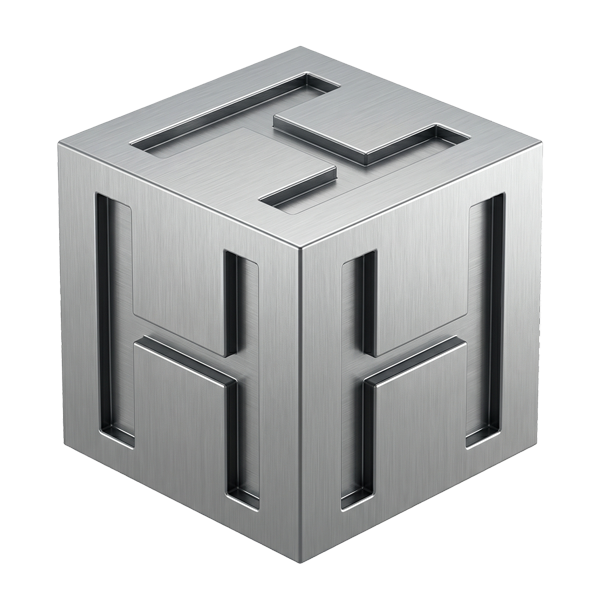

<p align="center">
  
</p>

# Hush Engine

[](https://pypi.org/project/hush-engine/)
[](https://www.gnu.org/licenses/agpl-3.0)
[](https://www.python.org/downloads/)
[](https://github.com/NewMediaStudio/hush-engine/actions/workflows/tests.yml)

Local-first PII detection for images, PDFs, and spreadsheets. Uses Microsoft Presidio for text detection and Apple Vision for OCR. Runs on your machine; nothing is uploaded.

> **Prefer a GUI?** [hushbee.app](https://hushbee.app) ships a free macOS app built on this engine. Drop files in, get redacted versions out.

## Features

**Formats**
Images (PNG, JPEG, HEIC), PDFs, Excel and CSV. Apple Vision OCR runs at 400 DPI.

**Detection**
27 PII types out of the box: names, emails, phone numbers, SSN, credit cards, IBAN, API keys, crypto wallets, passports, medical identifiers, and more. The full table is below.

**NER stack**
LightGBM classifiers handle token-level PERSON, LOCATION, ORGANIZATION, DATE_TIME, and ADDRESS at ~10MB total. A 7,500-name curated database across 54 locales provides fallback coverage. Optional heavyweight models (Flair, Transformers/BERT, GLiNER) add 2-3 percentage points of F1 for users who want maximum accuracy.

**International**
116 IBAN countries via `python-stdnum`. 249 phone country codes via `phonenumbers`. 35+ national ID formats. 800+ cities for LOCATION disambiguation.

**Validation**
Luhn for credit cards. Verhoeff for Aadhaar. Mod-11 and Mod-97 for other IDs. Context-aware thresholds boost confidence when headers or labels disambiguate.

**Extras**
Face detection (OpenCV Haar). QR and barcode decoding (Apple Vision). Runtime toggle for each NER backend.

## Install

```bash
pip install hush-engine
python -m spacy download en_core_web_lg
brew install poppler  # for PDFs
```

Optional extras:

```bash
pip install hush-engine[accurate]  # Flair + Transformers + GLiNER (~2GB)
pip install hush-engine[medical]   # Disease + drug NER
pip install hush-engine[address]   # libpostal bindings (99.45% accuracy, requires brew install libpostal)
pip install hush-engine[names]     # names-dataset (GPL-3.0, opt-in)
pip install hush-engine[full]      # medical + address + accurate
```

## Quick start

```python
from hush_engine import FileRouter

router = FileRouter()

# Image
result = router.detect_pii_image("screenshot.png")
for d in result["detections"]:
    print(f"{d['entity_type']}: {d['text']} ({d['confidence']:.2f})")

# PDF
result = router.detect_pii_pdf("document.pdf")
print(f"{result['total_pages']} pages, {len(result['detections'])} detections")
```

Direct use of the detector:

```python
from hush_engine import PIIDetector
detector = PIIDetector()
for e in detector.analyze_text("John Doe's email is john@example.com"):
    print(f"{e.entity_type}: {e.text}")
```

## Entity types

| Category | Type | Notes |
|---|---|---|
| Personal | `PERSON` | Multi-NER cascade with 7,500-name database |
| | `EMAIL_ADDRESS` | Regex with validation |
| | `PHONE_NUMBER` | 249 countries via libphonenumber |
| | `DATE_TIME` | Multiple formats including DD/MM/YYYY and card expiry (MM/YY) |
| | `AGE` | "25 years old", "Age: 45" |
| | `GENDER`, `NRP` | Demographic references |
| Financial | `CREDIT_CARD` | Luhn-validated, reconstructs fragmented OCR blocks |
| | `FINANCIAL` | SWIFT/BIC, IBAN (116 countries), crypto wallets, salaries (`$128k/yr`), labeled balances, masked accounts (`****7823`) |
| | `AWS_ACCESS_KEY`, `STRIPE_KEY` | Pattern-matched API keys |
| Government | `NATIONAL_ID` | SSN, passport, driver's license across 35+ countries |
| Medical | `MEDICAL` | ICD-10, conditions, medications (pattern-based by default) |
| Technical | `CREDENTIAL` | Passwords, tokens, keys (Shannon entropy) |
| | `IP_ADDRESS` | IPv4/IPv6 with version-string disambiguation |
| | `URL` | via `urlextract` |
| | `NETWORK` | MAC, IMEI, UUID, cookies, device IDs |
| Location | `LOCATION` | Addresses, cities, countries (libpostal optional) |
| | `COORDINATES` | Lat/long |
| Visual | `FACE`, `QR_CODE`, `BARCODE` | Apple Vision framework |
| Organization | `COMPANY`, `ORGANIZATION` | S&P 500 + international database |
| Vehicle | `VEHICLE` | VIN, license plates |
| Biometric | `BIOMETRIC` | Fingerprint IDs |
| Generic | `ID` | Employee ID, customer ID, generic identifiers |

See [docs/PII_REFERENCE.md](docs/PII_REFERENCE.md) for regulatory mapping (HIPAA, GDPR, CCPA).

## Architecture

| Component | Role |
|---|---|
| `FileRouter` | Entry point for file-level processing |
| `PIIDetector` | Presidio analyzer with 50+ custom recognizers |
| `PersonRecognizer` | NER cascade: NLTagger → LightGBM → name database → (optional) spaCy/Flair/Transformers/GLiNER |
| `VisionOCR` | Apple Vision wrapper at 400 DPI |
| `PDFProcessor` | PDF-to-image with parallel page processing |
| `TableDetector` | Context-aware detection for spreadsheets and tables |
| `ImageAnonymizer`, `SpreadsheetAnonymizer` | Redaction output |
| `FaceDetector` | OpenCV Haar cascade |
| `AddressVerifier`, `CompanyVerifier`, `CredentialEntropy`, `HeuristicVerifier` | Precision verifiers |
| `DetectionConfig` | Runtime thresholds and toggles |

### PERSON cascade

```
pattern match → LightGBM NER → NLTagger → names database → [spaCy] → [Flair] → [Transformers] → [GLiNER]
```

Lightweight engines run first. The cascade exits early when a high-confidence match is found. Heavy engines are skipped unless installed and explicitly enabled.

## Custom recognizers

```python
from hush_engine import PIIDetector
from presidio_analyzer import Pattern, PatternRecognizer

detector = PIIDetector()
detector.analyzer.registry.add_recognizer(
    PatternRecognizer(
        supported_entity="CUSTOM_ID",
        patterns=[Pattern("custom", r"[A-Z]{3}-\d{6}", 0.8)],
    )
)
```

## Configuration

```python
from hush_engine import DetectionConfig

config = DetectionConfig()
config.set_threshold("PERSON", 0.60)
config.set_enabled_entity("FACE", False)
config.set_enabled_integration("flair", False)
```

Thresholds persist to `~/.hush/detection_config.json`. Integrations: `lgbm_ner`, `spacy`, `flair`, `transformers`, `gliner`, `name_dataset`, `libpostal`, `urlextract`, `phonenumbers`.

## Performance

Synthetic golden set (1,000 samples generated with Faker):

| Metric | Score |
|---|---|
| F1 | 97.2% |
| Precision | 98.3% |
| Recall | 96.2% |

Kaggle PII Detection 2024 (1,000 student essays, 1,606 GT entities):

| Metric | Score |
|---|---|
| F1 | 93.0% |
| Precision | 94.5% |
| Recall | 91.6% |

Per-entity on the Kaggle set: PERSON 93.9% F1, EMAIL 98.7%, ID 88.6%, URL 87.2%, PHONE 85.7%. Latency: 266 ms/doc.

## Hush vs LLMs

Same Kaggle set, 1,000 samples:

| Model | F1 | Precision | Recall | Latency | RAM |
|---|---|---|---|---|---|
| **Hush Engine v1.10.0** | **93.0%** | **94.5%** | 91.6% | **266ms** | **~15MB** |
| Mistral 7B | 77.8% | 64.6% | 97.9% | 3,486ms | 10.2GB |
| Phi-4 (14B) | 75.3% | 65.0% | 89.5% | 6,046ms | 14.3GB |
| Qwen 2.5 (7B) | 65.7% | 49.8% | 96.5% | 3,105ms | 8.4GB |
| Gemma 2 (9B) | 63.7% | 47.2% | 97.9% | 4,250ms | 9.0GB |
| Llama 3.2 (1B) | 21.2% | 11.9% | 95.3% | 4,208ms | 4.7GB |

Reproduce:

```bash
python tests/benchmark_llm_comparison.py --samples 1000 --models mistral:7b,phi4:latest
```

## Development

```bash
git clone https://github.com/NewMediaStudio/hush-engine.git
cd hush-engine
pip install -e ".[dev]"
python -m spacy download en_core_web_lg
pytest tests/
```

### Benchmarks

```bash
python tests/benchmark_accuracy.py --samples 100
python tests/benchmark_accuracy.py --samples 1000
python tests/benchmark_server.py  # dashboard at http://localhost:8000
```

Bootstrap 95% confidence intervals:

```bash
python tools/bootstrap_ci.py --dataset tests/data/synthetic_golden.json
```

### Training LightGBM classifiers

```bash
python tools/train_lgbm_ner.py --entity-type PERSON --samples 5000
python tools/train_lgbm_ner.py --all --ai4privacy --augment --samples 10000
python tools/train_lgbm_ner.py --entity-type PERSON --custom-dataset path/to/data.json
```

### Kaggle dataset (optional)

The Kaggle PII Detection 2024 set requires a Kaggle account. After downloading `train.json`:

```bash
python tools/create_kaggle_golden.py  # 1,000-sample golden set for benchmarks
python tools/kaggle_pii_adapter.py --input tests/data/kaggle_train.json
```

## Requirements

- macOS 10.15+ (Apple Vision OCR)
- Python 3.10+

Windows and Linux support is on the roadmap but not yet available.

## Contributing

See [CONTRIBUTING.md](CONTRIBUTING.md). Report security issues per [SECURITY.md](SECURITY.md) instead of the public tracker.

## License

Hush Engine is dual-licensed.

**Open source:** [AGPL-3.0](LICENSE). Free to use, modify, and distribute under AGPL terms. If you run Hush over a network (for example, inside a SaaS), AGPL § 13 requires you to open-source the service that uses it.

**Commercial:** a paid commercial license is available for proprietary products, closed-source SaaS, or any use where AGPL obligations don't fit. See [COMMERCIAL-LICENSING.md](COMMERCIAL-LICENSING.md) or email **studio@newmediastudio.com**.

## Related

- **[Hushbee](https://hushbee.app)** — free macOS app built on this engine. Download there for a drag-and-drop GUI over the same detection pipeline.
- **[Microsoft Presidio](https://github.com/microsoft/presidio)** — the detection framework Hush builds on.

## Acknowledgments

Built on [Presidio](https://github.com/microsoft/presidio), [Apple Vision](https://developer.apple.com/documentation/vision), [spaCy](https://spacy.io/), [Flair](https://github.com/flairNLP/flair), [GLiNER](https://github.com/urchade/GLiNER), [libpostal](https://github.com/openvenues/libpostal), and [python-stdnum](https://github.com/arthurdejong/python-stdnum).
